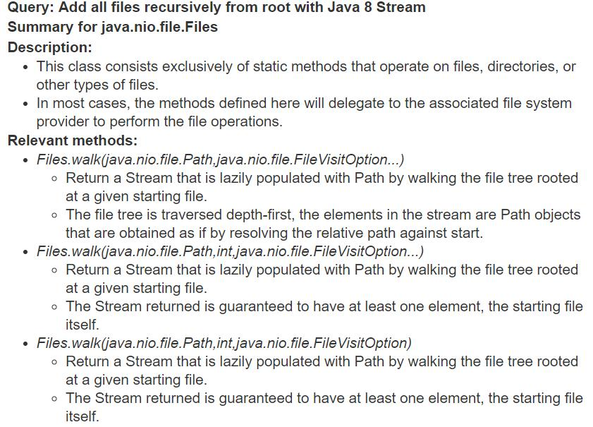
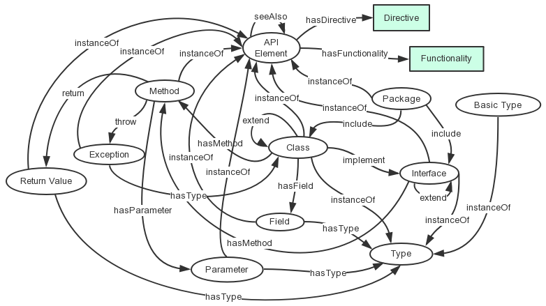

## Replication Package For Paper: Generating Query-specific Class API Summaries

### Summary Example:
Here is the summary example in Figure 1 from Paper, which explains how the summary look like:

  
### Schema Of API-KG
Here is the schema of API KG which is used to support API Summary Generation:

  

### RQ1: What is the intrinsic quality of the summaries generated by KG-APISumm ? 
In [SummaryForRQ1Queries.json](https://github.com/APIKnowledgeGraph/APIKnowledgeGraph.github.io/blob/master/data/RQ1/SummaryForRQ1Queries.json), we show the summary generated by our APIKGSumm approach for 12 queries.
In [RQ1SummaryQuality.csv](https://github.com/APIKnowledgeGraph/APIKnowledgeGraph.github.io/blob/master/data/RQ1/RQ1SummaryQuality.csv), we show the data for RQ1, that is the score for each class summary and the agreement.

### RQ2: How are the summaries generated by KG-APISumm different than those generated by other approaches? 
we compare the APIKGSumm with three different approach:
1. [google](https://github.com/APIKnowledgeGraph/APIKnowledgeGraph.github.io/blob/master/data/RQ2/google.json)
2. [biker](https://github.com/APIKnowledgeGraph/APIKnowledgeGraph.github.io/blob/master/data/RQ2/biker.json)
3. [textrank](https://github.com/APIKnowledgeGraph/APIKnowledgeGraph.github.io/blob/master/data/RQ2/textrank.json)

### RQ3: How useful are the summaries generated by KGAPISumm in helping developers during API retrieval?

Here is the query we chosen from Biker data set and their query type:
1. single_top_1
    - How can I read input from the console using the Scanner class in Java?
    - How to wait for all threads to finish, using ExecutorService?
2. single_top_3
    - Listing only files in directory
    - Is there a way to instantiate a class by name in Java?
        
3. single_top_5

    - How do I properly load a BufferedImage in java?
    - Avoiding PermGen out of memory and GC overhead limit exceeded
4. single_not_top_10
    - Is there any way to find os name using java?
    - Stable timer independent of system time

5. single_top_10
    - How do I Click a JButton without the user Clicking it?
    - How to generate a random permutation in Java?

6. multi_top3
    - Reading a plain text file in Java
    - Load Java Image inside package from a class in a different package
 
7. multi_top5
    - Java - Draw a ruler (line with tick marks at 90 degree angle)
    - How to make a symlink in Java when running in Linux?
8. multi_top10
    - Stop a Runnable submitted to ExecutorService
    - Preferred Java way to ping an HTTP URL for availability
    
9. multi_one_top10
    - How to make ImageIO read from InputStream :Java
    - How do I print a double value without scientific notation using Java
10. multi_all_not_top10
    - Varargs method modifies caller's array instead of its own copy?
    - How to hide cursor in a Swing application?

- We use biker to search for each query and get the top-10 classes for each query. The data is show in [BikerTopSearchResult.json](https://github.com/APIKnowledgeGraph/APIKnowledgeGraph.github.io/blob/master/data/RQ3/BikerTopSearchResult.json) 
- We generate class summary based on Biker search result and it is shown in  [GeneratedSummaryForBikerSearchResult.json](https://github.com/APIKnowledgeGraph/APIKnowledgeGraph.github.io/blob/master/data/RQ3/GeneratedSummaryForBikerSearchResult.json). 
- And Here we provide the [RQ3StaticsResult.json](https://github.com/APIKnowledgeGraph/APIKnowledgeGraph.github.io/blob/master/data/RQ3/RQ3StaticsResult.json) file. The json file contains the ground truth classes for each query, the raw data about complete time and correctness for each query. It also contain some statistical results for each query, such as mean complete time.

### RQ4: Is KG-APISumm generating different summaries for different queries, for the same class? 

We select seven queries from Biker data set that contain the same class in the ground truth, namely [java.nio.file.Files](https://docs.oracle.com/javase/8/docs/api/java/nio/file/Files.html). The class provides methods that operate on files and directories.

Here is seven different class summary for different queries:

#### 1. Query: Elegant way to read file into byte[] array in Java
   
Summary for java.nio.file.Files
- Description:
   - This class consists exclusively of static methods that operate on files, directories, or other types of files.
   - In most cases, the methods defined here will delegate to the associated file system provider to perform the file operations.
- Methods:	
    - java.nio.file.Files.readAllBytes(java.nio.file.Path)
		- Reads all the bytes from a file.
		- Note that this method is intended for simple cases where it is convenient to read all bytes into a byte array.
	- java.nio.file.Files.write(java.nio.file.Path,byte[],java.nio.file.OpenOption)
		- All bytes in the byte array are written to the file.
		- Writes bytes to a file.
	- java.nio.file.Files.copy(java.io.InputStream,java.nio.file.Path,java.nio.file.CopyOption...)
		- Copies all bytes from an input stream to a file.
		- If an I/O error occurs reading from the input stream or writing to the file, then it may do so after the target file has been created and after some bytes have been read or written.

#### 2. Getting A File's Mime Type In Java
Summary for java.nio.file.Files
- Description:
    - This class consists exclusively of static methods that operate on files, directories, or other types of files.
    - In most cases, the methods defined here will delegate to the associated file system provider to perform the file operations.
- Methods:	
	- java.nio.file.Files.probeContentType(java.nio.file.Path)
		- Probes the content type of a file.
		- If the file is recognized then the content type is returned.
	- java.nio.file.Files.createTempFile(java.nio.file.Path,java.lang.String,java.lang.String,java.nio.file.attribute.FileAttribute<?>)
		- When no file attributes are specified, then the resulting file may have more restrictive access permissions to files created by the createTempFile(String, String, File) method.
		- Where used as a work files, the resulting file may be opened using the DELETE_ON_CLOSE option so that the file is deleted when the appropriate close method is invoked.
	- java.nio.file.Files.createTempFile(java.nio.file.Path,java.lang.String,java.lang.String,java.nio.file.attribute.FileAttribute<?>...)
		- When no file attributes are specified, then the resulting file may have more restrictive access permissions to files created by the File.createTempFile(String,String,File) method.
		- Creates a new empty file in the specified directory, using the given prefix and suffix strings to generate its name.

#### 3. getting file creator/owner attributes in Java
Summary for java.nio.file.Files
- Description:
    - This class consists exclusively of static methods that operate on files, directories, or other types of files.
    - In most cases, the methods defined here will delegate to the associated file system provider to perform the file operations.
- Methods:
	- java.nio.file.Files.getOwner(java.nio.file.Path,java.nio.file.LinkOption...)
		- Returns the owner of a file.
		- This file attribute view provides access to a file attribute that is the owner of the file.
	- java.nio.file.Files.setOwner(java.nio.file.Path,java.nio.file.attribute.UserPrincipal)
		- This file attribute view provides access to a file attribute that is the owner of the file.
		- Updates the file owner.
	- java.nio.file.Files.getOwner(java.nio.file.Path,java.nio.file.LinkOption)
		- Returns the owner of a file.
		- This file attribute view provides access to a file attribute that is the owner of the file.

#### 4. How to append text to file in Java 8 using specified Charset
Summary for java.nio.file.Files
- Description:
    - This class consists exclusively of static methods that operate on files, directories, or other types of files.
    - In most cases, the methods defined here will delegate to the associated file system provider to perform the file operations.
- Methods:
	- java.nio.file.Files.newBufferedWriter(java.nio.file.Path,java.nio.file.OpenOption...)
		The text is encoded into bytes for writing using the UTF-8 charset.
		Opens or creates a file for writing, returning a BufferedWriter to write text to the file in an efficient manner.
	- java.nio.file.Files.write(java.nio.file.Path,java.lang.Iterable<? extends java.lang.CharSequence>,java.nio.file.OpenOption...)
		Characters are encoded into bytes using the UTF-8 charset.
		Write lines of text to a file.
	- java.nio.file.Files.lines(java.nio.file.Path)
		Bytes from the file are decoded into characters using the UTF-8 charset.
		Read all lines from a file as a Stream.

#### 5. How can I write to a specific line number in a txt file in Java
Summary for java.nio.file.Files
- Description:
    - This class consists exclusively of static methods that operate on files, directories, or other types of files.
    - In most cases, the methods defined here will delegate to the associated file system provider to perform the file operations.
- Methods:
	- java.nio.file.Files.write(java.nio.file.Path,java.lang.Iterable<? extends java.lang.CharSequence>,java.nio.charset.Charset,java.nio.file.OpenOption...)
		- Write lines of text to a file.
		- Each line is a char sequence and is written to the file in sequence with each line terminated by the platform's line separator, as defined by the system property line.separator.
	- java.nio.file.Files.readAllLines(java.nio.file.Path,java.nio.charset.Charset)
		- Read all lines from a file.
		- Note that this method is intended for simple cases where it is convenient to read all lines in a single operation.
	- java.nio.file.Files.write(java.nio.file.Path,java.lang.Iterable<? extends java.lang.CharSequence>,java.nio.file.OpenOption)
		- Write lines of text to a file.
		- Characters are encoded into bytes using the UTF-8 charset.

#### 6. add custom attribute or metadata to file java
Summary for java.nio.file.Files
- Description:
    - In most cases, the methods defined here will delegate to the associated file system provider to perform the file operations.
    - This class consists exclusively of static methods that operate on files, directories, or other types of files.
- Methods:
	- java.nio.file.Files.getFileAttributeView(java.nio.file.Path,java.lang.Class<V>,java.nio.file.LinkOption...)
		- The BasicFileAttributeView type supports access to the basic attributes of a file.
		- This method is intended to be used where the file attribute view defines type-safe methods to read or update the file attributes.
	- java.nio.file.Files.readAttributes(java.nio.file.Path,java.lang.String,java.nio.file.LinkOption...)
		- If not specified then it defaults to "basic", the name of the file attribute view that identifies the basic set of file attributes common to many file systems.
		- The following examples demonstrate possible values for the attributes parameter: "*" Read all basic-file-attributes.
	- java.nio.file.Files.getOwner(java.nio.file.Path,java.nio.file.LinkOption...)
		- This file attribute view provides access to a file attribute that is the owner of the file.
		- The path parameter is associated with a file system that supports FileOwnerAttributeView.

#### 7. Add all files recursively from root with Java 8 Stream
Summary for java.nio.file.Files
- Description:
    - This class consists exclusively of static methods that operate on files, directories, or other types of files.
    - In most cases, the methods defined here will delegate to the associated file system provider to perform the file operations.
- Methods:
	- java.nio.file.Files.walk(java.nio.file.Path,java.nio.file.FileVisitOption...)
		- Return a Stream that is lazily populated with Path by walking the file tree rooted at a given starting file.
		- The file tree is traversed depth-first, the elements in the stream are Path objects that are obtained as if by resolving the relative path against start.
	- java.nio.file.Files.walk(java.nio.file.Path,int,java.nio.file.FileVisitOption...)
		- Return a Stream that is lazily populated with Path by walking the file tree rooted at a given starting file.
		- The Stream returned is guaranteed to have at least one element, the starting file itself.
	- java.nio.file.Files.walk(java.nio.file.Path,int,java.nio.file.FileVisitOption)
		- Return a Stream that is lazily populated with Path by walking the file tree rooted at a given starting file.
		- The Stream returned is guaranteed to have at least one element, the starting file itself.
